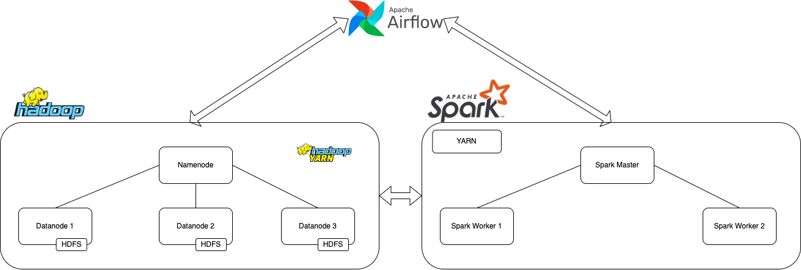

# Learn Hadoop Using Docker



This is just for learning intention, not recomended for production. Use Hortonworks or Cloudera for production instead or you can just setup using cloud service. In GCP there is Dataproc or in AWS there is EMR (Elastic Map Reduce).

## Download binary

- This Dockerfile build from existing hadoop image but, if you want to download the binary first instead build your own Dockerfile image :
<https://archive.apache.org/dist/hadoop/common/hadoop-3.3.6/hadoop-3.3.6.tar.gz>
- Download Apache Spark Binary <https://downloads.apache.org/spark/spark-3.3.6/>

## Kick-off Cluster

1. Clone this repos to your project directory, and `cd hadoop-docker`
2. If you are in Linux/MAC Just simply run `./run_cluster.sh`
3. If you are in Windows try run this command `docker build -t hadoop-base:3.3.6 . && docker-compose up`

## How to run MapReduce Job

1. There is `ratings_breakdown.py` python file in `map_reduce` directory, we can run this file on a local python mode or in Hadoop world
2. For python mode local run command `python3 map_reduce/ratings_breakdown.py input/u.data`
3. To run this file in Hadoop run this command `python3 map_reduce/ratings_breakdown.py -r hadoop --hadoop-streaming-jar /opt/hadoop-3.3.6/share/hadoop/tools/lib/hadoop-streaming-3.3.6.jar input/u.data`
4. Path `/opt/hadoop-3.3.6/share/hadoop/tools/lib/hadoop-streaming-3.3.6.jar` might be different for users or if you are using different version of Hadoop, run command `find / hadoop-streaming-$(HADOOP_VERSION).jar` to find it

## Running with hadoop command

1. Make sure you have `input` directory in HDFS, if it's not exist just run this command `hadoop fs -mkdir -p input`
2. Put your data in `input` directory in your local project `hdfs dfs -put ./input/* input`
3. And ready to run

```
hadoop jar /opt/hadoop-3.3.6/share/hadoop/tools/lib/hadoop-streaming-3.3.6.jar -file /hadoop-data/map_reduce/word_count/mapper.py -mapper "python3 mapper.py" -file /hadoop-data/map_reduce/word_count/reducer.py -reducer "python3 reducer.py" -input input/words.txt -output output_word_count
```

## Hadoop Configurations

1. core-site.xml default and description [here](https://hadoop.apache.org/docs/r3.3.6/hadoop-project-dist/hadoop-common/core-default.xml)
2. hdfs-site.xml default and description [here](https://hadoop.apache.org/docs/r3.3.6/hadoop-project-dist/hadoop-hdfs/hdfs-default.xml)
3. mapred-site.xml default and description [here](https://hadoop.apache.org/docs/r3.3.6/hadoop-mapreduce-client/hadoop-mapreduce-client-core/mapred-default.xml)
4. yarn-site.xml default and description [here](https://hadoop.apache.org/docs/r3.3.6/hadoop-yarn/hadoop-yarn-common/yarn-default.xml)
5. To calculate YARN and MapReduce memory configuration [here](https://docs.cloudera.com/HDPDocuments/HDP2/HDP-2.0.9.0/bk_installing_manually_book/content/rpm-chap1-11.html)

## End to end step by step to kick-off Airflow, Spark Cluster and Hadoop Cluster

Please start everything from `run_cluster.sh` because the base image created from this step

## To Do

- Add Hive configuration files
  - `hive-site.xml`
  - `beeline-log4j2.properties`
  - `hive-exec-log4j2.properties`
  - `hive-log4j2.properties`
  - `llap-daemon-log4j2.properties`
  - `ivysettings.xml`
  - `hive-env.sh`
